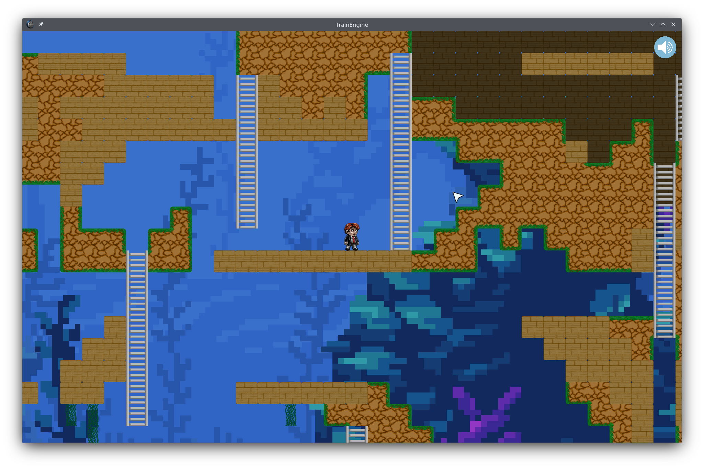

# TrainEngine

Cross-platform 2D game engine made with C++ and SFML.

## Features

- Game state management
- Multimedia resource manager
- Input manager (with both callbacks and polling support)
- Frame interpolation
- Multi-view camera
- Animated entities
- Parallax
- GUI
- Tilemap level editor
- Physics
- Profiling information



## Prerequisites

- GCC or Clang
    > Note: For Windows, make sure you have Mingw-w64 SEH 6.1.0 64-bit installed and in your PATH. This version is important since SFML's binaries are shipped with the engine. If you want to use a different compiler, you must recompile SFML 2.4.2 and replace it in the engine under `libs/SFML-2.4.2`.
- Make

## Usage

### Building

```sh
make
```

### Running

```sh
make copyassets run
```

### Formatting

```sh
make format
```

### Cleaning

```sh
make clean
```

### More information

```sh
$ make help
Usage: make target... [options]...

Targets:
  all             Build executable (debug mode by default) (default target)
  install         Install packaged program to desktop (debug mode by default)
  run             Build and run executable (debug mode by default)
  copyassets      Copy assets to executable directory for selected platform and configuration
  clean           Clean build and bin directories (all platforms)
  cleanassets     Clean assets from executable directories (all platforms)
  format          Run clang-format on source code
  doc             Generate documentation with Doxygen
  help            Print this information
  printvars       Print Makefile variables for debugging

Options:
  release=1       Run target using release configuration rather than debug
  win32=1         Build for 32-bit Windows (valid when built on Windows only)
  ios=1           Build for iOS (valid when built on macOS only)

Note: the above options affect all, install, run, copyassets, and printvars targets
```

## License

[MIT](https://opensource.org/license/mit/)
